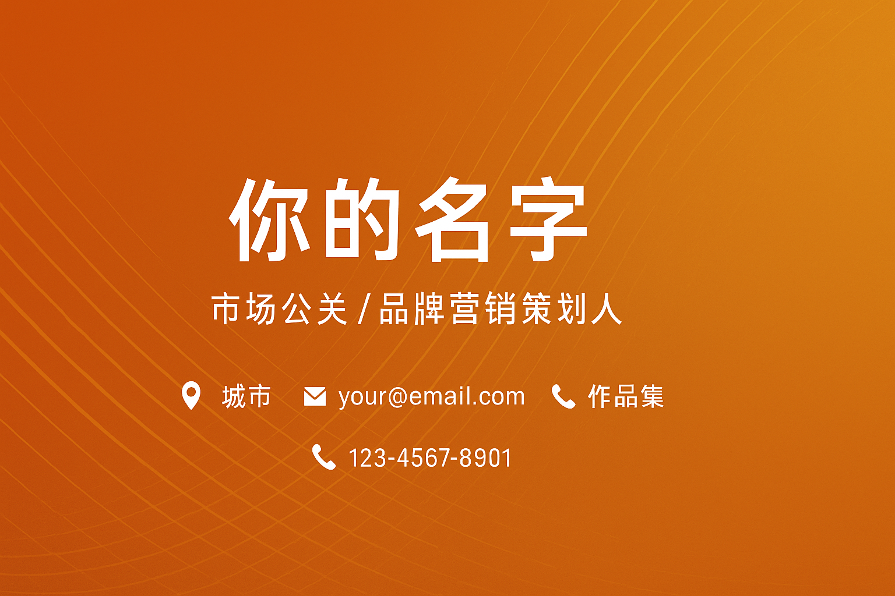

# 你的名字
**市场公关 / 品牌营销策划人**  
📍 城市 | 📧 your@email.com | 📱 123-4567-8901 | 🔗 [作品集](https://your-portfolio.com)

---

## 👩‍💼 关于我
拥有 AI、游戏、互联网等多个行业的整合营销与公关经验。擅长从用户洞察出发，策划高传播性的社会化话题，统筹全渠道营销，平衡品牌曝光与业务转化。具备扎实的媒体资源与跨部门协作能力。

---

## 💼 代表项目

### 🚀 DeepSeek 安卓首发整合传播
- 抢发引爆央媒与友商连锁反应，形成行业话题热点  
- 联动党央媒与科技媒体，提升品牌权威性与用户信任度

### 🎉 线下IP活动 & 节日节点营销
- **生活节**：联合区域性媒体 & 本地生活平台，带动区域流量与互动  
- **春节CNY哪吒红包**：借势热点文化IP，社交平台话题冲榜  
- **Chinajoy**：线下展会策划与现场传播执行

### 🌟 ESG & 品牌故事
- 策划「看见女性力量」主题传播，结合媒体深度报道与社交平台互动  
- 多渠道传递品牌价值观，形成长期影响力

### 📡 高管微博矩阵运营
- 系统化、栏目化打造高管人设与粉丝互动体系  
- 联合营销与跨平台内容矩阵（微博、公众号、视频号、小红书）

---

## 📈 核心能力
- **整合营销策划**：从年度营销规划到单场活动执行的全链路管理  
- **媒体关系维护**：党央媒、高价值垂媒资源深度合作  
- **社会化话题运营**：热点借势、内容创意、舆情风险识别  
- **跨部门协作**：高效对接产研、设计、运营，确保业务目标达成  
- **数据驱动优化**：以 PV、DAU、曝光、声量、转化等指标为导向

---

## 🏆 媒体与作品集（部分）
- 深圳商报：献礼特区45周年专题  
- WAIC 官方媒体【第一财经】深度报道  
- 新华社、人民日报、美通社、环球时报 快讯与专访  
- 生态伙伴合作案例（阿里、网易云）  
- [更多作品链接 ➡](https://your-portfolio.com)

---

## 🎯 关键词
`品牌营销` `事件公关` `整合传播` `热点策划` `社交媒体运营` `AI行业` `游戏行业` `互联网`
